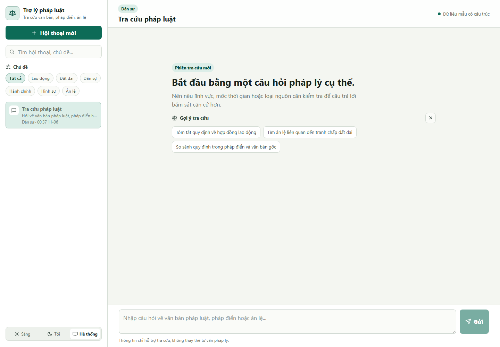
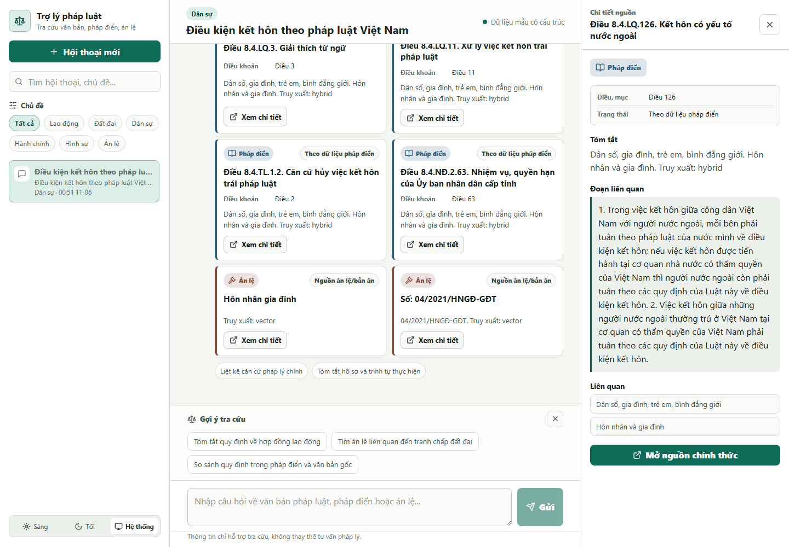

# Vietnamese Legal RAG Chatbot

A Vietnamese legal research chatbot for legal instruments, codified law, and case law / precedents. The backend is a FastAPI RAG service. The frontend is a React/Vite chatbot workspace for serious legal research.

The system is designed to retrieve legal evidence first, then use LLM agents to rewrite, route, validate, and synthesize the answer. The LLM should not be treated as the legal source of truth.

App disclaimer: `Thong tin chi ho tro tra cuu, khong thay the tu van phap ly.`

## What this project does

- Answers Vietnamese legal research questions using retrieved evidence.
- Searches three source groups:
  - `Van ban phap luat`: original legal instruments where available through the indexed corpus.
  - `Phap dien`: codified legal provisions from the Ministry of Justice dataset.
  - `An le` / judgments: precedents and court judgments from the court dataset.
- Shows citation cards in the frontend with source type, title, article/clause metadata when available, status/date metadata when available, and a detail action.
- Opens a source detail panel when a citation is clicked.
- Saves conversation memory by `session_id` so follow-up questions can use recent context.
- Uses explicit prompt YAML files under `src/prompts/` for agent behavior.

## Frontend preview

The screenshots below are captured from the actual React/Vite chatbot workspace.

Initial workspace:



Real chat demo after a live frontend -> FastAPI -> RAG/LLM request:



Captured demo details:

- Question submitted in the UI: `Dieu kien ket hon theo phap luat Viet Nam`.
- Backend route: frontend `/api/chat` proxy to FastAPI `/chat`.
- Result: real assistant response with 8 citation cards.
- The first citation detail panel was opened before taking the screenshot.
- Runtime for this capture was about 3.5 minutes on the local setup.

## Repository structure

```text
.
|-- src/
|   |-- app/
|   |   `-- api.py                      # FastAPI app and HTTP endpoints
|   |-- agents/                         # Explicit AI agent classes
|   |   |-- memory_rewrite_agent.py
|   |   |-- source_router_agent.py
|   |   |-- phrase_extractor_agent.py
|   |   |-- issue_analyzer_agent.py
|   |   |-- evidence_validator_agent.py
|   |   `-- answer_generator_agent.py
|   |-- prompting/                      # YAML prompt loading/rendering
|   |-- prompts/                        # Prompt YAML files for each agent
|   |-- retrieval/                      # Vector, FTS, routing, validation helpers
|   |-- memory/                         # SQLite conversation memory
|   |-- rag/                            # Compatibility wrappers
|   `-- workflows/
|       `-- legal_rag_workflow.py       # Main RAG orchestration pipeline
|-- frontend/
|   |-- src/components/                 # ChatLayout, Sidebar, ChatThread, etc.
|   |-- src/services/                   # Frontend API client
|   |-- src/types/                      # TypeScript legal/chat types
|   |-- vite.config.ts                  # Vite proxy from /api to backend
|   `-- package.json                    # Frontend scripts
|-- data/
|   |-- huggingface/                    # Downloaded legal datasets
|   |-- index/                          # SQLite indexes and conversation memory
|   `-- vectorstores/                   # Chroma vector stores
|-- download_hf_datasets.py             # Download datasets from Hugging Face
|-- verify_hf_downloads.py              # Verify downloaded dataset files
|-- build_reference_index.py            # Build Phap Dien reference SQLite index
|-- build_phapdien_fts5.py              # Build Phap Dien FTS5 SQLite index
|-- embed_phapdien.py                   # Build Phap Dien Chroma vector store
|-- embed_anle.py                       # Build An Le / judgment Chroma vector store
`-- build_ontology_router.py            # Build ontology router vector store
```

## Backend pipeline

For a `/chat` request, the backend runs this flow:

1. Load conversation memory by `session_id`.
2. `MemoryRewriteAgent` rewrites the user message into a clearer standalone legal query.
3. `route_query` detects broad legal topic/intent from the ontology.
4. `SourceRouterAgent` decides how much evidence to retrieve from each source group.
5. `PhraseExtractorAgent` extracts Vietnamese legal search phrases.
6. `search_all` retrieves evidence from vector stores, SQLite FTS, and reference indexes.
7. Optional validation runs through `EvidenceValidatorAgent` and repair retrieval.
8. `AnswerGeneratorAgent` writes the final Vietnamese answer grounded in retrieved evidence.
9. The turn and compact source context are saved to SQLite conversation memory.

## Requirements

### System

- Python 3.10+ recommended.
- Node.js 20+ recommended.
- Windows PowerShell, macOS shell, or Linux shell.
- NVIDIA API key for chat and embedding models.
- Internet access for first-time dataset download and embedding/index creation.

### Python dependencies

This repo currently does not include a pinned `requirements.txt`. Install the backend and data dependencies manually:

```powershell
python -m venv .venv
.\.venv\Scripts\Activate.ps1
python -m pip install --upgrade pip
python -m pip install fastapi uvicorn python-dotenv pydantic numpy pandas pyarrow pyyaml tqdm huggingface_hub chromadb langchain-core langchain-chroma langchain-nvidia-ai-endpoints langchain-text-splitters
```

On macOS/Linux:

```bash
python -m venv .venv
source .venv/bin/activate
python -m pip install --upgrade pip
python -m pip install fastapi uvicorn python-dotenv pydantic numpy pandas pyarrow pyyaml tqdm huggingface_hub chromadb langchain-core langchain-chroma langchain-nvidia-ai-endpoints langchain-text-splitters
```

## Environment variables

Create a `.env` file in the project root:

```env
NVIDIA_API_KEY=your_embedding_api_key
NVIDIA_API_LLM=your_chat_api_key_optional_if_same_as_NVIDIA_API_KEY
NVIDIA_LLM_MODEL=your_nvidia_chat_model
NVIDIA_EMBED_MODEL=your_nvidia_embedding_model
```

Notes:

- `NVIDIA_API_KEY` is used by embedding scripts and retrieval embeddings.
- `NVIDIA_API_LLM` is used by chat generation if set.
- If `NVIDIA_API_LLM` is missing, the backend falls back to `NVIDIA_API_KEY` for the LLM.
- Do not commit real API keys.

## Data setup

If `data/huggingface`, `data/index`, and `data/vectorstores` already exist, you can usually skip this section and run the app directly.

For a fresh setup, run these commands from the project root:

```powershell
python .\download_hf_datasets.py
python .\verify_hf_downloads.py
python .\build_reference_index.py
python .\build_phapdien_fts5.py
python .\embed_phapdien.py
python .\embed_anle.py
python .\build_ontology_router.py
```

Expected outputs:

- `data/huggingface/phapdien-moj-gov-vn/`
- `data/huggingface/anle-toaan-gov-vn/`
- `data/index/phapdien_reference_index.sqlite`
- `data/index/phapdien_fts.sqlite`
- `data/index/anle_parents.sqlite`
- `data/vectorstores/phapdien_chroma_nvidia/`
- `data/vectorstores/anle_chroma_nvidia/`
- `data/vectorstores/ontology_router_chroma_nvidia/`

Embedding can take time because it calls the NVIDIA embedding API in batches.

## Run the backend

From the project root:

```powershell
.\.venv\Scripts\Activate.ps1
python -m uvicorn src.app.api:app --reload --host 127.0.0.1 --port 8000
```

Health check:

```text
http://127.0.0.1:8000/health
```

Expected response:

```json
{"status":"ok"}
```

Interactive API docs:

```text
http://127.0.0.1:8000/docs
```

## Run the frontend

Open a second terminal:

```powershell
cd .\frontend
npm.cmd install
npm.cmd run dev -- --host 127.0.0.1 --port 5173 --force
```

Open:

```text
http://127.0.0.1:5173
```

The Vite dev server proxies frontend calls from `/api/*` to `http://127.0.0.1:8000`.

To call another backend URL, create `frontend/.env.local`:

```env
VITE_API_BASE_URL=http://127.0.0.1:8000
```

Then restart the frontend dev server.

## Run backend and frontend together

Use two terminals.

Terminal 1, backend:

```powershell
cd "C:\Users\Luc\OneDrive\Documents\Law RAG"
.\.venv\Scripts\Activate.ps1
python -m uvicorn src.app.api:app --reload --host 127.0.0.1 --port 8000
```

Terminal 2, frontend:

```powershell
cd "C:\Users\Luc\OneDrive\Documents\Law RAG\frontend"
npm.cmd run dev -- --host 127.0.0.1 --port 5173 --force
```

Then visit:

```text
http://127.0.0.1:5173
```

## API reference

### GET /health

Checks whether the API is running.

PowerShell:

```powershell
Invoke-RestMethod -Uri "http://127.0.0.1:8000/health"
```

### POST /chat

Runs the full RAG workflow and returns an answer plus sources.

Request body:

```json
{
  "message": "Quy trinh dang ky giay ket hon la gi?",
  "session_id": null,
  "k": 8,
  "validation_mode": "none",
  "include_debug": false
}
```

Fields:

| Field | Type | Default | Description |
| --- | --- | --- | --- |
| `message` | string | required | User question. Vietnamese with accents is supported. |
| `session_id` | string or null | null | Existing conversation id. If null, backend creates one. |
| `k` | integer | 8 | Retrieval size. Must be from 1 to 20. |
| `validation_mode` | string | `none` | Use `none`, `validate`, or `repair`. |
| `include_debug` | boolean | false | Return route, source routing, query phrases, and validation debug info. |

PowerShell example:

```powershell
$body = @{
  message = "Quy trinh dang ky giay ket hon la gi?"
  session_id = $null
  k = 8
  validation_mode = "none"
  include_debug = $false
} | ConvertTo-Json

Invoke-RestMethod `
  -Uri "http://127.0.0.1:8000/chat" `
  -Method Post `
  -ContentType "application/json; charset=utf-8" `
  -Body $body
```

curl example:

```bash
curl -X POST "http://127.0.0.1:8000/chat" \
  -H "Content-Type: application/json" \
  -d '{
    "message":"Quy trinh dang ky giay ket hon la gi?",
    "session_id":null,
    "k":8,
    "validation_mode":"none",
    "include_debug":false
  }'
```

Example response shape:

```json
{
  "session_id": "generated-or-existing-session-id",
  "answer": "Vietnamese grounded answer...",
  "original_query": "Quy trinh dang ky giay ket hon la gi?",
  "rewritten_query": "...",
  "rewrite": {},
  "intent": "...",
  "quotas": {},
  "validation_mode": "none",
  "sources": [
    {
      "source_type": "phapdien",
      "title": "...",
      "source_url": "...",
      "content": "...",
      "score": 0.123,
      "context_mode": "...",
      "retrieval_mode": "...",
      "metadata": {
        "topic_title": "...",
        "subject_title": "...",
        "article_title": "...",
        "original_article_number": "...",
        "doc_name": "...",
        "doc_code": "...",
        "detail_url": "...",
        "pdf_url": "..."
      }
    }
  ]
}
```

Use `include_debug: true` when you need to inspect routing, extracted phrases, validation output, or original source lists.

### POST /search

Runs retrieval and optional validation without final answer generation.

PowerShell example:

```powershell
$body = @{
  message = "Tim an le lien quan den tranh chap dat dai"
  session_id = "demo-session"
  k = 10
  validation_mode = "validate"
  include_debug = $true
} | ConvertTo-Json

Invoke-RestMethod `
  -Uri "http://127.0.0.1:8000/search" `
  -Method Post `
  -ContentType "application/json; charset=utf-8" `
  -Body $body
```

Use `/search` when you want to inspect retrieved evidence before answer synthesis.

### GET /sessions/{session_id}

Reads saved conversation memory.

```powershell
Invoke-RestMethod -Uri "http://127.0.0.1:8000/sessions/demo-session"
```

### POST /sessions/{session_id}/reset

Clears saved memory for a session.

```powershell
Invoke-RestMethod -Uri "http://127.0.0.1:8000/sessions/demo-session/reset" -Method Post
```

## Frontend usage

The first screen is the chatbot workspace, not a landing page.

Main areas:

- Left sidebar: conversation list, new chat, search, and topic/category filters.
- Center chat: user questions, assistant answers, prompt suggestions, loading/error/no-result states.
- Citation cards: source type, title, article/clause metadata, source status/date when available, summary, and detail action.
- Right source panel: source metadata plus excerpt/detail text.
- Theme switcher: light, dark, and system.
- Mobile layout: sidebar and source detail become compact drawers/tabs.

Suggested prompts in the UI include Vietnamese examples such as labor contract summaries, land dispute case-law search, and comparison between codified law and original legal instruments.

## Prompt YAML files

Agent prompts are stored in `src/prompts/` and loaded by `src/prompting/loader.py`.

Current prompt files:

- `memory_rewrite.yaml`
- `source_router.yaml`
- `phrase_extractor.yaml`
- `issue_analyzer.yaml`
- `evidence_validator.yaml`
- `answer_generator.yaml`

The YAML prompts are written in English for better instruction following, but they explicitly require Vietnamese retrieval terms and Vietnamese final answers.

When editing prompts:

1. Keep role, goal, constraints, output format, and fallback behavior explicit.
2. Keep JSON output schemas strict for agents that return structured data.
3. Do not ask the LLM to invent legal sources.
4. Keep final user-facing answers in Vietnamese.
5. Run backend compile checks after changes.

## Development checks

Backend syntax check:

```powershell
python -m compileall src
```

Frontend lint:

```powershell
cd .\frontend
npm.cmd run lint
```

Frontend typecheck:

```powershell
cd .\frontend
npm.cmd run typecheck
```

Frontend production build:

```powershell
cd .\frontend
npm.cmd run build
```

Preview the production build:

```powershell
cd .\frontend
npm.cmd run preview -- --host 127.0.0.1 --port 4173
```

## Troubleshooting

### Frontend is blank at 127.0.0.1:5173

Restart Vite and clear the Vite cache:

```powershell
cd "C:\Users\Luc\OneDrive\Documents\Law RAG\frontend"
Remove-Item -Recurse -Force .\node_modules\.vite -ErrorAction SilentlyContinue
npm.cmd run dev -- --host 127.0.0.1 --port 5173 --force
```

Also confirm that the browser is opened to:

```text
http://127.0.0.1:5173
```

### Backend port 8000 is blocked or forbidden

Check what owns the port:

```powershell
Get-NetTCPConnection -LocalPort 8000 -ErrorAction SilentlyContinue | Select-Object LocalAddress,LocalPort,State,OwningProcess
```

Stop the process if it is safe to do so:

```powershell
Stop-Process -Id <PID>
```

Or run the backend on another port:

```powershell
python -m uvicorn src.app.api:app --reload --host 127.0.0.1 --port 8010
```

If you change the backend port, also set frontend `VITE_API_BASE_URL`:

```env
VITE_API_BASE_URL=http://127.0.0.1:8010
```

### API returns no useful answer

Check these items:

- Backend terminal has no Python exception.
- `.env` contains valid NVIDIA model names and API keys.
- `data/vectorstores/*` exists and was built with the same embedding model used at query time.
- `data/index/phapdien_fts.sqlite` and `data/index/phapdien_reference_index.sqlite` exist.
- Try `include_debug: true` on `/chat` to inspect routing and retrieved sources.
- Try `/search` to see whether retrieval is failing before answer generation.

### PowerShell displays Vietnamese incorrectly

Run commands with UTF-8 output enabled:

```powershell
$OutputEncoding = [Console]::OutputEncoding = [System.Text.UTF8Encoding]::new()
```

### The bot does not answer project/general questions

The current RAG workflow is optimized for legal source lookup. General project questions such as "what documents does this system use?" may be routed into legal retrieval and produce weak answers unless you add a separate project/system-info intent and a trusted project knowledge source.

A clean future fix is to add a small `ProjectInfoAgent` or a project FAQ retrieval source that answers only factual questions about this system.

### Detail questions about a selected case/precedent are shallow

The current frontend opens citation detail locally, but follow-up chat messages do not automatically send the selected source content back to `/chat`. Because of that, a question like "explain this precedent in detail" may trigger a new retrieval instead of using the selected citation.

A clean future fix is to send selected citation context in the chat request, add an An Le detail mode, and expand the An Le context window for detail requests.

## Legal and product limitations

- This is a legal research assistant, not a lawyer.
- The answer should be treated as a starting point for research.
- Always inspect cited legal sources before relying on the result.
- Source metadata may be incomplete when the dataset does not contain status, effective date, article number, or detail URL.
- Retrieval quality depends heavily on dataset freshness, embedding model consistency, and prompt configuration.

## Recommended workflow for daily development

1. Start backend on `127.0.0.1:8000`.
2. Start frontend on `127.0.0.1:5173`.
3. Ask a normal Vietnamese legal question in the UI.
4. If the answer looks wrong, call `/chat` with `include_debug: true`.
5. Inspect retrieved `sources` and routing debug.
6. Fix retrieval/indexing first if sources are bad.
7. Fix prompt YAML or answer synthesis only after retrieval evidence is good.
8. Run `python -m compileall src` and frontend checks before committing.